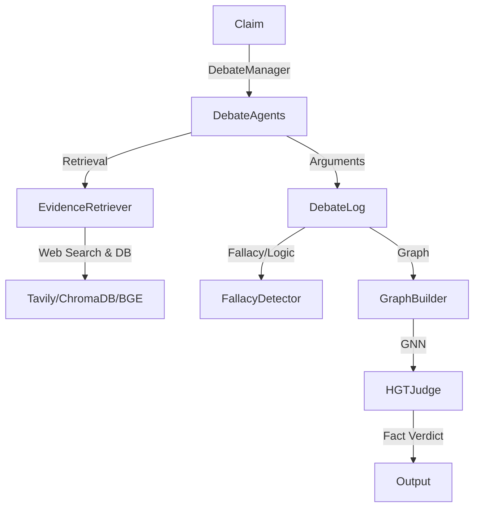

# FIRE-DEBATE: Fact-Checking, Investigation, Retrieval, and Evaluation - Debate System

## Overview
FIRE-DEBATE (Fact-Checking, Investigation, Retrieval, and Evaluation - Debate System) is a modular, research-grade and production-ready neuro-symbolic system for automated fact-checking debates between AI agents. It combines retrieval-augmented generation, agentic debate, neuro-symbolic reasoning, and graph neural networks to evaluate claims, generate arguments, and judge factuality. The system is highly extensible and supports both local and cloud LLMs, real-time web search, and advanced evidence evaluation.

---

## Features
- **Agentic Debate**: Simulates debates between rational, adversarial, and manipulative agents.
- **Retrieval-Augmented Generation**: Integrates real-time web search (Tavily, DuckDuckGo) and dense retrieval (ChromaDB, BGE-Small).
- **Fact-Checking Pipeline**: Judges arguments using logic/fallacy detection and a GNN-based (HGT) judge.
- **Modular Design**: Swap LLMs (OpenAI, Qwen, Llama), retrieval models, and agent strategies easily.
- **Extensive Scripts**: For data generation, training, evaluation, and visualization.
- **Research & Production Ready**: Designed for reproducibility, extensibility, and robust evaluation.

---

## Directory Structure & File Functions
See `flow.md` for a full, annotated file-by-file breakdown. Example:

```
fire_debate/
├── configs/
│   ├── base.yaml         # Main config (API keys, model, retrieval, debate settings)
│   └── .env              # (Sensitive keys, not for git)
├── data/
│   ├── raw/              # Raw datasets (train.json, test.json, etc.)
│   ├── processed/        # Processed debate logs, graphs, etc.
│   └── chroma_db/        # ChromaDB vector store
├── fire_debate/
│   ├── agents/           # Debate agents (rational, sophist, moderator, etc.)
│   ├── debate/           # Debate manager (orchestrates rounds)
│   ├── insight/          # Fallacy detection, graph builder, GNN judge
│   ├── rag/              # Retrieval logic (Tavily, BM25, BGE)
│   ├── schemas/          # Data schemas (DebateTurn, EvidenceDoc)
│   └── training/         # Training scripts for judge models
├── scripts/              # CLI scripts for running, evaluating, generating data
├── experiments/          # Experiment runner
├── requirements.txt      # Python dependencies
├── README.md             # (This file)
├── flow.md               # Full file-by-file breakdown
└── ...
```

---

## Quickstart

### 1. Install Dependencies
```bash
pip install -r requirements.txt
```

### 2. Configure API Keys
- Add your OpenAI and Tavily API keys to `configs/base.yaml` or `.env`.

### 3. Run a Debate
```bash
python scripts/run_debate.py
```

### 4. Generate Data
```bash
python scripts/generate_data.py
```

### 5. Train the Judge
```bash
python fire_debate/training/train_judge.py
```

### 6. Evaluate
```bash
python scripts/evaluate_model.py
```

---

## Pipeline & Flow

### High-Level Flow



### How Files Connect
- `scripts/run_debate.py` loads config, instantiates agents, runs a debate via `DebateManager`.
- `DebateManager` coordinates `DebaterAgent` (pro/con), `ModeratorAgent`, and `SynthesisAgent`.
- `DebaterAgent` uses `EvidenceRetriever` for search, `Librarian` for filtering.
- `insight/graph_builder.py` builds argument graphs; `insight/hgt_judge.py` judges them.
- All data flows through schemas in `schemas/`.

---

## Extending & Customizing
- Add new agent types in `fire_debate/agents/`.
- Swap LLMs by editing `configs/base.yaml`.
- Add new retrieval methods in `rag/retriever.py`.
- Modify debate logic in `debate/manager.py`.

---

## Potential Issues & Warnings
- **API Keys**: Never commit real keys to git. Use `.env` for secrets.
- **VRAM**: For local LLMs, set quantization in `base.yaml` to match your GPU.
- **Data Paths**: Ensure data files exist in `data/raw/` and `data/processed/`.
- **Imports**: Some scripts use relative imports; run from project root.
- **Error Handling**: Some modules print warnings but do not raise exceptions (e.g., missing models, API keys).
- **Empty `__init__.py` files**: These are fine for package structure, but ensure all modules are imported as needed.
- **Potential for missing files**: If you move or rename files, update all import paths accordingly.

---

## Visual Diagrams (Optional)

For enhanced clarity, you can add static visual diagrams (PNG/SVG) generated from the Mermaid code above or with tools like Graphviz. This is helpful for presentations or users who prefer images over code diagrams.

### How to Generate and Add Visual Diagrams

1. **Mermaid Live Editor**
   - Go to [Mermaid Live Editor](https://mermaid.live/)
   - Paste the Mermaid code from the README
   - Export as PNG or SVG
   - Save the image in a `docs/` folder (e.g., `docs/pipeline_flow.png`)
   - Reference it in the README:
     ```markdown
     
     ```

2. **Graphviz**
   - Write a `.dot` file describing your pipeline
   - Use `dot -Tpng pipeline.dot -o docs/pipeline_flow.png` to generate an image
   - Reference as above

3. **Keep Both**
   - Keep Mermaid/Markdown diagrams for GitHub-native rendering
   - Add PNG/SVG for static viewing and presentations

---

## Citation & Contribution
- Please cite this repository if you use it in research.
- Contributions, bug reports, and feature requests are welcome!

---

## License
[MIT License](LICENSE)

---

## Contact
For questions or support, open an issue or contact the maintainer.